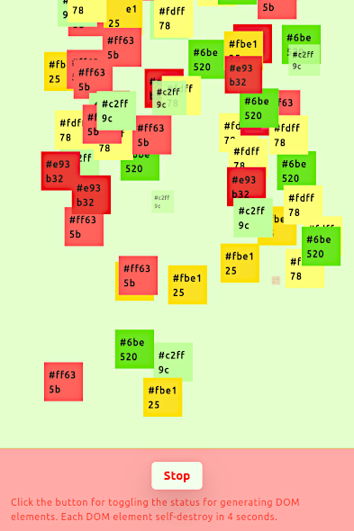

# rawjs-generate



[View Demo](https://tokyo800.jp/mina/rawjs/)

## 1. About

A sample [RawJS](https://github.com/squaresapp/rawjs) app with PUB/SUB messaging to generate/destroy DOM elements.

Here are highlights for the app provided:

- Constantly generates DOM elements every 30 msec, each being destroyed in 4 sec. Stops when clicking 'Stop' button, resumes on 'Start' button.
- Wraps the main content and footer so that updates the page layout upon 'resize' event. Not only are they being destroyed, but the same elements being appended again.
- Use of [Broadcast Channel API](https://developer.mozilla.org/en-US/docs/Web/API/Broadcast_Channel_API) for in-app PUB/SUB messaging.
- Examples implementing [Crockford's methods](https://www.crockford.com/javascript/prototypal.html). By not using ES6 class syntax, we can bring all the FP goodies from React development (see [GenericWrapper](src/services/generic_wrapper.js)).
- Type signatures using JSDoc instead of TypeScript for the above mentioned Crockford's methods. Lets you generate `*.d.ts` files from JSDoc comments.

Also, the following minor features:

- PostCSS for CSS assets which will be loaded at runtime afterward.
- Use of TailwindCSS, not within JS codes, but only for the mentioned runtime assets.

## 2. Instruction

To run the program:
```
npm run start
```

To generate `*.d.ts` files to `/types`:
```
npm run type:generate
```

To generate JSDoc documents to `/jsdoc`:
```
npm run jsdoc
```

To build:
```
npm run build
```

## 3. Notes

### 3-1. Why A Sample For Generating/Destroying Elements?

As we use [RawJS](https://github.com/squaresapp/rawjs),
page layouts will remain unchanged once they are created.
If it were in React, it constantly listens to prop changes,
and will automatically add or remove components.
However, that is not the case for *RawJS*.

Consider receiving `resize` events.
Screen size changes as devices switches between PC and mobile.
It would usually suffice if we changed CSS styles.
Yet, we sometimes want to change page structures dramatically.
To do so, we need to explicitly destroy existing elements
and replace them with new ones.

In this sample app, we have
[GenericMeta](src/services/generic_meta.js).
When elements are wrapped with `GenericMeta`,
they implement `destroy` method. The idea is awfully simple.
When `destroy` is called, it will tell the parent to remove the child.
This wrapper is implemented for randomly generated boxes.

Similarly, [GenericWrapper](src/services/generic_wrapper.js),
is just another wrapper which wraps `GenericMeta`,
and it has `update` method.
It will not only let you destroy elements,
but also to add elements for the second time (and onward).
The wrapper is used for changing the page layout upon "resize" event.

Assuming the mentioned scenario is quite common when using *RawJS*,
hence, demonstrating generate/destroy operations on DOM elements.

### 3-2. Notes on Various Messaging APIs

There are several ways to achieve in-app messagings.

#### Broadcast Channel API

If we wanted a simple Pub/Sub solution,
[Broadcast Channel API](https://developer.mozilla.org/en-US/docs/Web/API/Broadcast_Channel_API)
is the best.
This is for communications among different components within the app.
While Safari has long been not supporting the API,
they recently released the implementation,
and we now have supports from all the major browsers in the market.

#### Channel Messaging API

Whereas **Broadcast Channel API** allows you to broadcast 1-way messages
for anonymous receivers within the app,
[Channel Messaging API](https://developer.mozilla.org/en-US/docs/Web/API/Channel_Messaging_API)
lets you setup connections between specific clients.
With this API, you have 2-way communications.

#### Shared Worker API

[Shared Worker API](https://developer.mozilla.org/en-US/docs/Web/API/SharedWorker)
also allows you to achieve 2-way communications.
However, unlike two APIs described previously,
it requires an external script (ususally, named as `sw.js`).
In the script, you create message channels.
For these channels, you establish connections from other programs within the app.
I personally love the interface design this API has,
however, Android Chrome has not yet support the API for long,
and I don't think they ever will...

#### Service Worker API

[Service Worker API](https://developer.mozilla.org/en-US/docs/Web/API/Service_Worker_API)
is similar to **Shared Worker API**, however, it is 1-way.
Like, **Shared Worker API**, it has an external script (usually, `sw.js`),
and you create channels there.
The rest is the same as what you did in **Shared Worker API**.
Since it only has 1-way communication
(where the external script is the only one listens to client programs),
a library like [Workbox](https://developer.chrome.com/docs/workbox)
from Chrome team internally uses **Channel Messaging API** to make it 2-way.
After the introduction of PWA, **Service Worker API** has become
popular for its cache mechanism. Yet, it is still a messaging API after all.
For it offers a high-level control over cache resouces,
it tends to make the app over-complicated.

For this sample app, we're using **Broadcast Channel API** because we only want an iternal messaging among different components.

### 3-3. JSDoc and TypeScript Union Type

When we want to extend an object type definition
to create another, we currently have no way of
doing so to satisfy both JSDoc and TypeScript.
Yes, there are many techniques that are very close
to achieving, but in the end, there are none!

In a nutshell, the only way is to use [jsdoc-plugin-intersection](https://github.com/chriseaton/jsdoc-plugin-intersection).
The plugin allows you to use `&` which is of TypeScript,
and it will convert `&` into `|` of JSDoc.

Consider the following (found in [here](src/services/screen_size.js)):

```js
/**
 * @typedef ScreenSize
 * @type {{ width: number, height: number }}
 */

/**
 * @typedef ScreenSizePayload
 * @type {ScreenSize & { is_mobile: boolean }}
 */
```

Here, we want to create `ScreenSizePayload` by extending `ScreenSize`,
and want to add `is_mobile` as a new field.
Notice that I have `&`. While it is not a valid syntax to JSDoc,
it will generate documents without any issues.

And, this is what we get:  
[types/services/screen_size.d.ts](types/services/screen_size.d.ts)
```typescript
export type ScreenSize = {
    width: number;
    height: number;
};

export type ScreenSizePayload = ScreenSize & {
    is_mobile: boolean;
};
```

## 4. Installed NPM Packages

### RawJS

- @squaresapp/rawjs

### Babel

- core-js
- @babel/cli
- @babel/core
- @babel/preset-env
- babel-loader

### Webpack

- webpack
- webpack-cli
- webpack-dev-server
- file-loader
- css-loader
- style-loader
- postcss-loader
- html-webpack-plugin
- copy-webpack-plugin
- mini-css-extract-plugin
- license-webpack-plugin

### ESLint & Prettier

- prettier
- eslint
- eslint-config-prettier
  - Filters out all the ESLint rules which conflict with Prettier.
- eslint-plugin-prettier
  - Orchestrates ESLint and Prettier together.
- @stylistic/eslint-plugin
  - New way of setting rules

### CSS

- postcss
- postcss-cli
- postcss-preset-env
- postcss-import
- postcss-mixins
- postcss-nested
- autoprefixer
- tailwindcss
- babel-plugin-preval

### JSDoc

- jsdoc
- jsdoc-tsimport-plugin
- ~~jsdoc-to-markdown~~
  - High vulnerability depnding on: jsdoc-parse
- jsdoc-plugin-intersection
- typescript

### Jest

- jest
- babel-jest

### Others

- rimraf
- nodemon
- concurrently

```
npm install --save core-js @squaresapp/rawjs;

npm install --save-dev @babel/cli @babel/core \
  @babel/preset-env babel-jest babel-loader \
  webpack webpack-cli webpack-dev-server \
  file-loader css-loader style-loader postcss-loader \
  html-webpack-plugin copy-webpack-plugin \
  mini-css-extract-plugin license-webpack-plugin \
  prettier eslint eslint-config-prettier eslint-plugin-prettier \
  @stylistic/eslint-plugin \
  postcss postcss-cli autoprefixer \
  postcss-preset-env postcss-import postcss-mixins postcss-nested \
  tailwindcss babel-plugin-preval \
  jsdoc jsdoc-tsimport-plugin \
  jsdoc-plugin-intersection \
  typescript jest \
  rimraf nodemon concurrently ;
```

## 5. License

Dual-licensed under either of the followings.  
Choose at your option.

- The UNLICENSE ([LICENSE.UNLICENSE](LICENSE.UNLICENSE))
- MIT license ([LICENSE.MIT](LICENSE.MIT))


